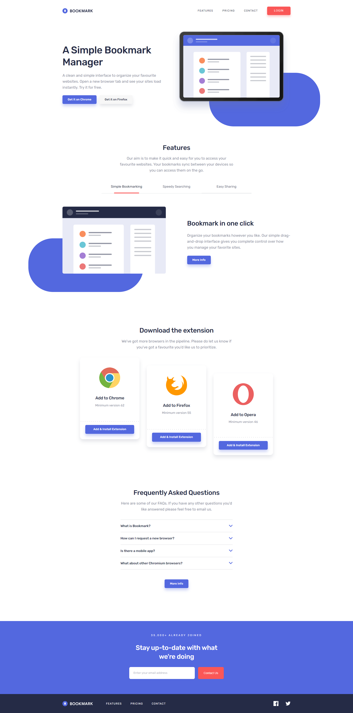

# Frontend Mentor - Bookmark landing page solution

This is a solution to the [Bookmark landing page challenge on Frontend Mentor](https://www.frontendmentor.io/challenges/bookmark-landing-page-5d0b588a9edda32581d29158). Frontend Mentor challenges help you improve your coding skills by building realistic projects.

## Overview

Frontend Mentor challenges help you improve your coding skills by building realistic projects.

### The challenge

Users should be able to:

- View the optimal layout for the site depending on their device's screen size
- See hover states for all interactive elements on the page
- Receive an error message when the newsletter form is submitted if:
  - The input field is empty
  - The email address is not formatted correctly

### Screenshot

### Links

- Solution URL: [Add solution URL here](https://github.com/mattbegnoche/FEM-Bookmark-Landing-Page)
- Live Site URL: [Add live site URL here](https://fem-bookmark-landing-page-begnoche.netlify.app/)

## My process

### Built with

- Astro
- Vanilla CSS
- Vanilla JavaScript

### What I learned

I used this project to get into Astro, a new framework for building websites. I learned how to use Astro components and how to structure a project using Astro's file-based routing. I also learned how to integrate vanilla JavaScript and CSS into an Astro project.

I also used this project to practice working with AI and treating it as a junior developer. I used GitHub Copilot to create the first draft of the site. What I found is that AI is great for a first pass, but it is not good at understanding growing projects. It put all of the code in one component and didn't break it out into different folders. Making it difficult to go in and find where all the logic lives. I found myself asking it to refactor code and sort it out. I found myself worrying more about the project shape and not actually writing code. I think this is a good lesson in how to use AI as a junior developer. It can be a great tool, but it is not a replacement for understanding the project and how to structure it.

### Continued development

Moving forward, I am going to working writing skills to help improve the AIs understanding of how I want to shape the project. I also wantt to make sure I am understanding everything the AI is generating and not just accepting it as correct. I want to make sure I am learning and not just using AI as a crutch.

## Author

- Website - [Matt Begnoche Development](https://www.mattbegnoche.com)
- Frontend Mentor - [@mattbegnoche](https://www.frontendmentor.io/profile/mattbegnoche)
- LinkedIn - [Matt Begnoche](https://www.linkedin.com/in/matt-begnoche/)
